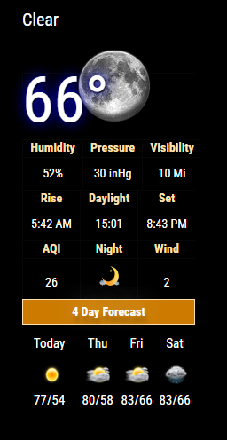
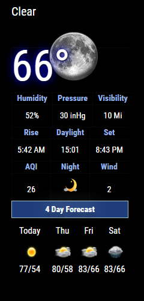
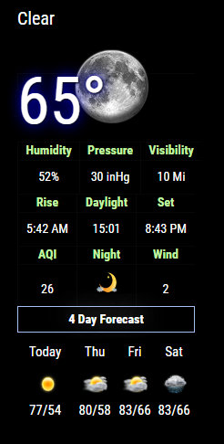

This repository is maintained by Cowboysdude 


[This is the third version of this module for MagicMirror2]

# MMM-NOAA V3.0

**Weather for your mirror**

* Also UV index and Air Quality Index.  [Warning AQI may not work in all areas].

## Examples

See below!!  

* Automatically adjusts language and all other settings based on your config.js!

## Your terminal installation instructions

* `git clone https://github.com/cowboysdude/MMM-NOAA3` into the `~/MagicMirror/modules` directory.
*  `cd MMM-NOAA3`
*  `npm install`

## Get your free API key here [WEATHER, You must also get an AirAPI Key--- see below]

There are multiple providers to choose from:  You only need one api from one of these providers below:
Remember not all providers are created equal... Some are a bit better than others :)

* weatherbit ~ https://www.weatherbit.io/api
* Pirateweather ~ https://pirate-weather.apiable.io/  //[userlat and userlong ONLY work with this right now] 
* weatherunlocked ~ https://developer.weatherunlocked.com/   [provides both api and appid keys, need them both, see example]
* accuweather ~ https://developer.accuweather.com/
* openweather ~ https://openweathermap.org/api 
 
##    YOU WILL NEED YOUR LATITUDE AND LONGITUDE
 You can find them right here: 
        https://www.latlong.net/
 
## Get your AirKEY from here

[https://airvisual.com/api](https://airvisual.com/api)

## Config.js entry and options

Will automatically select translation file and either F or C by reading your defaults from the config.js file [at the top]
Will default to EN if NO translation file is found.  
   
## Provider name MUST be in the config.js. Here they are:
	 
* weatherbit  
* pirateweather
* weatherunlocked 
* accuweather  
* openweather 
    
* For all of them EXCEPT WEATHERUNLOCKED
     ```   {
        module: 'MMM-NOAA3',
	position: 'top_left',
        config: {
		    provider: "must be in quotes", // From list above
		    apiKey: "YOUR API KEY",        // From one of the providers listed above
		    airKey: "YOUR API KEY",    
	        css: "NOAA3",                   // THIS MUST CONTAIN A CSS STYLE NAME 
		userlat: "xxxx", //MUST HAVE BOTH
	        userlon: "xxxx"  //MUST HAVE BOTH
	 }
         },
	```
* WeatherUnlocked API Example:
	```
	  {
        module: 'MMM-NOAA3',
	position: 'top_left',
        config: {
		    provider: "weatherunlocked",       
		    apiKey: "YOUR API KEY",  
		    appID: "YOUR APP ID",  
		    airKey: "YOUR API KEY", 
	        css: "NOAA3",                  // THIS MUST CONTAIN A CSS STYLE NAME
		userlat: "xxxx", //MUST HAVE BOTH
	        userlon: "xxxx"  //MUST HAVE BOTH
	 }
         },
	```

	
It seems that when using Accuweather, the zip code needs to be the 6 digit code from accuweather.com's website found after typing in the zip code into their search bar.
From Zip Code "13502" returns "329671"-which is what I put in my config file in order to get it to display local weather.
zip: '329671', //MUST have valid zip Code
	
* Accuweather Example:
	```
	 {
        module: 'MMM-NOAA3',
	position: 'top_left',
        config: {
		provider: "accuweather",   
		airKey: "YOUR API KEY", 
	        css: "NOAA3",                 // THIS MUST CONTAIN A CSS STYLE NAME 
		userlat: "xxxx", //MUST HAVE BOTH
	        userlon: "xxxx"  //MUST HAVE BOTH
		zip: "11111" //MUST have valid zip Code
	}
    },
	
## ISSUES

  While we tried to make NOAA everything a weather module can be, not everyone will give out weather warnings with the free api key.
  Thanks to Wunderground going belly up on the users........ soooooo we suggest that you use this module for warnings->	
  
  https://github.com/LukeSkywalker92/MMM-DWD-WarnWeather
  
  This is a weather warning module that will fit the bill nicely :)
  
## UpdateInterval

Via the config you can change this..... currently it's set to 30 minutes like this ->  updateInterval: 30 * 60 * 1000

You can add this to your config.js to change it if you'd like ... like this ->

    {
        module: 'MMM-NOAA3',
        config: {
		    provider: "Yahoo",   
		    airKey: "YOUR API KEY", 
	        css: "NOAA3",   // THIS MUST CONTAIN A CSS STYLE NAME
		    updateInterval: 15 * 60 * 1000, // every 15 minutes or whatever you choose but make sure you have an api that will allow that many calls per day!!! 
		   userlat: "xxxx", //MUST HAVE BOTH
	           userlon: "xxxx"  //MUST HAVE BOTH 
	}
    },
	
## CSS STYLES

* You can choose one of 5 styles [colors] for NOAA3 
     * MMM-NOAA1
     * MMM-NOAA2
     * MMM-NOAA3
     * MMM-NOAA4
     * and NOW
     * MMM-NOAA5 (smaller foot print!!  USE at own risk, still needs further testing)

## NOAA1 (Color style #1)  
 

## NOAA2 (Color style #2)  
 

## NOAA3 (Color style #3)  
 


## NOAA4 (Changes colors automatically)  

No plans for this... 

## NOAA5 (More condensed)

No plans for this...

## What's the mouseover?
Now when you mouse over current temp at the top you'll get your forecast.....
When you mouseover on the 4 day forecast you'll get your forecast for that day ....(see NOAA4 example above)..  

## Custom CSS
What if I want just plain ole white?  
Well just go to your css directory in MagicMirror2 and open up the css directory and edit your custom.css file like this!  
 ```
  .MMM-NOAA3 .rheading {
     background-color:  #000;
     border: none;
     }
  .MMM-NOAA3  .divTableHead {
      color: #fff;
     }  
```  
That will give you plain old white headings OR pick any color style you want!!  :) Like this->  

     
## Start your mirror . . . enjoy! 
  The first time you run it .....you may get an error.  It needs to find your lat/lon.  The 1st time you run it is when it finds it.....after that it will work without issue :)
